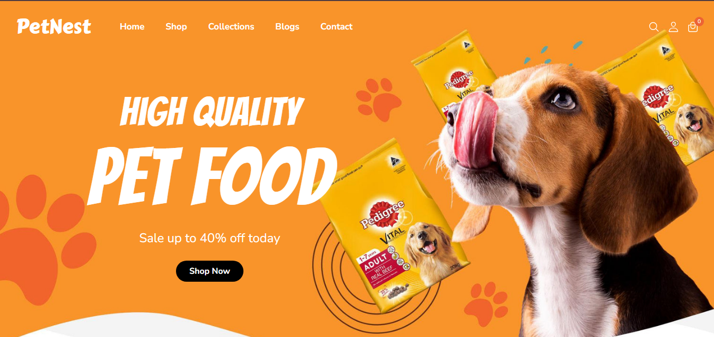
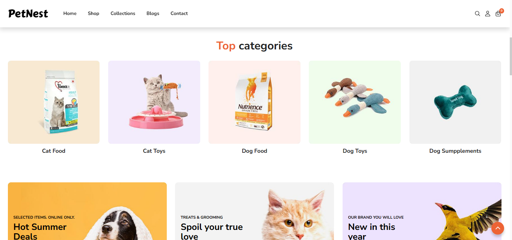
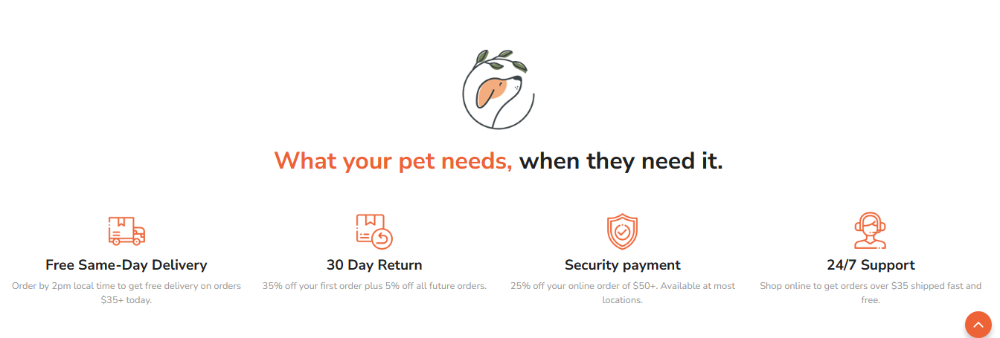
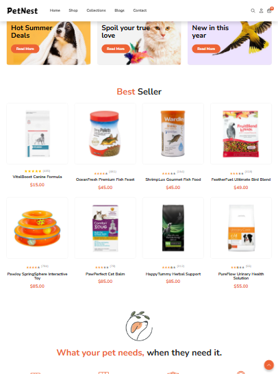

# PetNest - A Pet Care Website

Welcome to PetNest, a pet care website designed to enhance the experience of pet owners. This project is built with HTML, CSS, and JavaScript, focusing on a clean and visually appealing interface that is both user-friendly and functional.

<h2>Features</h2>

<h4>🛍️ Interactive Product Listings</h4>

Showcasing a range of pet products with easy-to-navigate categories, ensuring a seamless browsing experience.

<h4>📱 Responsive Design</h4>

Designed to work flawlessly across different devices, providing an optimal viewing experience on desktops, tablets, and smartphones.

<h5>Smartphone view</h5>

<h5>Tablet view</h5>

<h4>⚡ Dynamic Elements</h4>

JavaScript-powered interactivity enhances user experience, including real-time updates and engaging animations.

<h2>Tech Stack</h2>

HTML – Structuring the web pages

CSS – Styling for a visually appealing interface

JavaScript – Enhancing interactivity and functionality

<h2>🚀 Live Demo</h2>

Check out the live version of PetNest here: https://shreya2526.github.io/PetNest/

<h2>📌 About the Project</h2>

This project highlights my ability to create engaging web applications while following best practices in front-end development. PetNest aims to be a go-to destination for pet care solutions, blending aesthetic design with practical functionality.

Thank you for visiting! 🐶🐾
