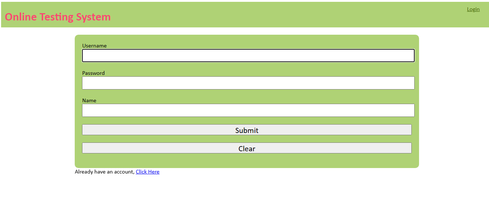
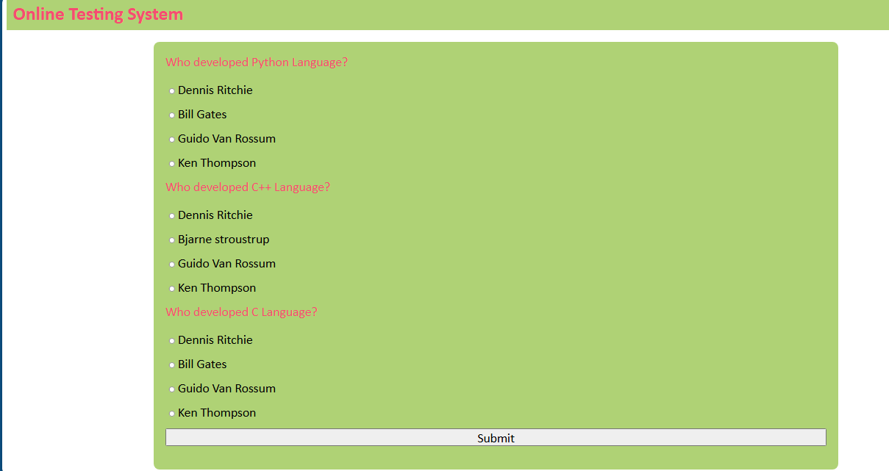

# Online Test Website

Welcome to the Online Test Website, a platform where users can sign up and take tests with different formats. Users can also track their test results and history while earning points based on their performance.

<h2>Features</h2>

▪ User Authentication: Sign up, log in into your account.

<h4>Sign in Page</h4>

<h4>Login Page</h4>

Three Test Paper Formats:

📝 One-question test paper

📝 Three-question test paper

📝 Five-question test paper

<h4>Three-question Test Paper</h4>

▪ Test History & Results: Users can review their past test results anytime.

▪ Point System: Earn points based on your test performance (scored out of 10).

<h4>Test History</h4>

<h2>Tech Stack</h2>

▪ Frontend: HTML, CSS, JavaScript

▪ Backend: Django (Python)

▪ Database: MySQL
