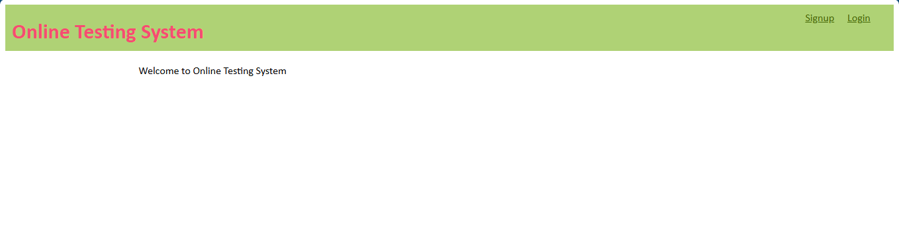
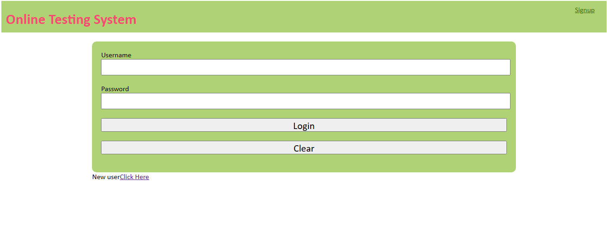
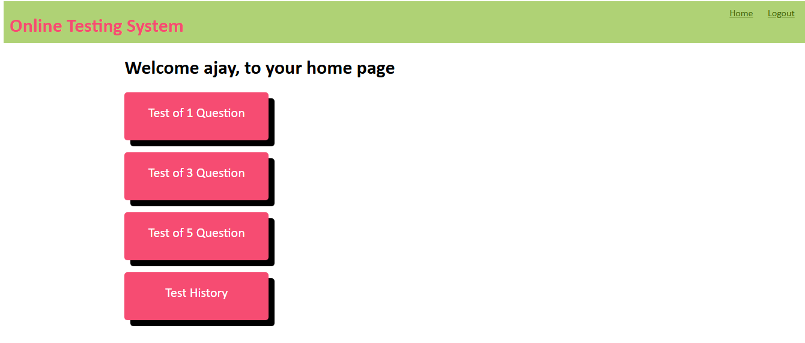
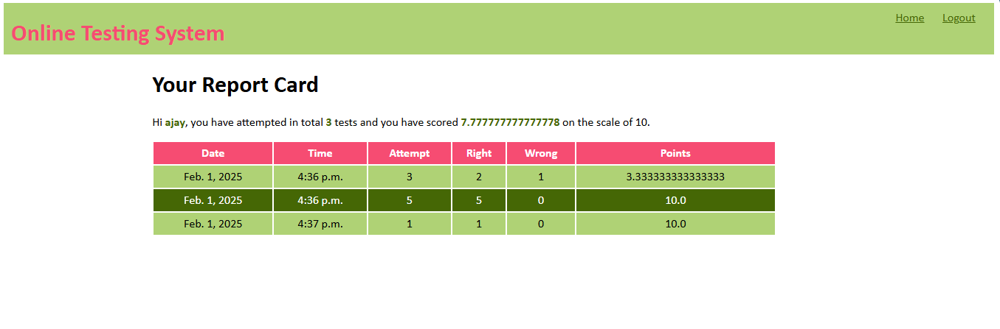

# Frontend-Dev

<h2>Online Test Website</h2>

Welcome to the Online Test Website, a platform where users can sign up and take tests with different formats. Users can also track their test results and history while earning points based on their performance.

<h3>Features</h3>

▪ User Authentication: Sign up, log in into your account.

Three Test Paper Formats:

📝 One-question test paper

📝 Three-question test paper

📝 Five-question test paper

▪ Test History & Results: Users can review their past test results anytime.

▪ Point System: Earn points based on your test performance (scored out of 10).

<h3>Tech Stack</h3>

▪ Frontend: HTML, CSS, JavaScript

▪ Backend: Django (Python)

▪ Database: MySQL

